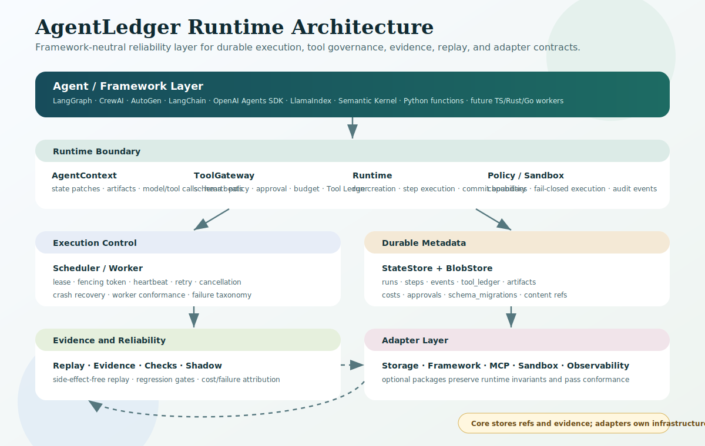
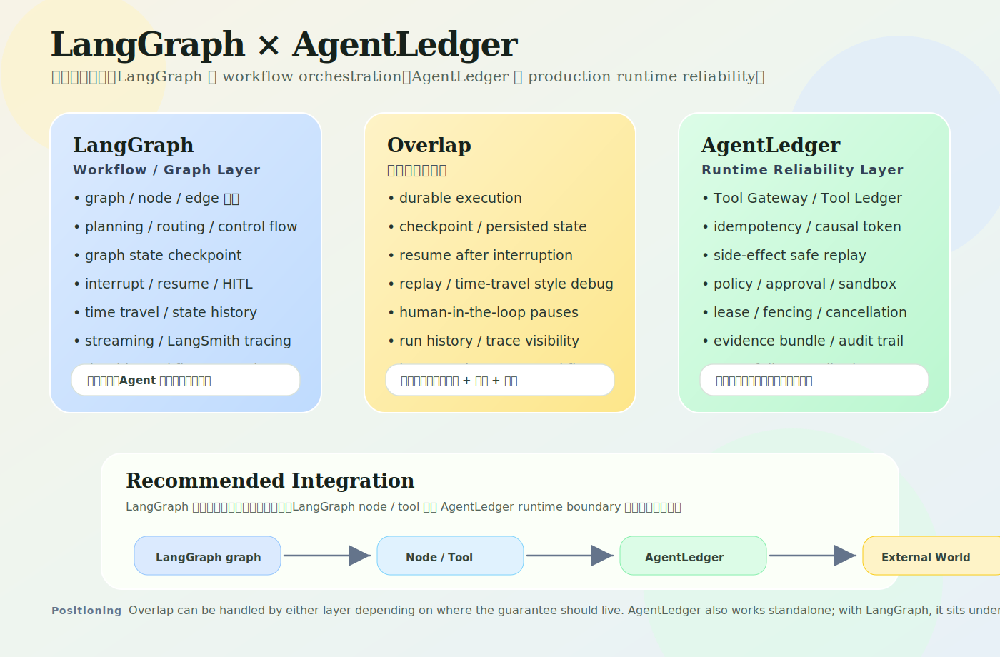

# AgentLedger

[English](README.md) | [中文](README.zh-CN.md)


AgentLedger `1.0.2` is an agent execution safety, evidence, and reliability layer. It does not try to teach agents how to reason; it makes agent runs durable, auditable, replayable, policy-governed, and recoverable when workers crash, tools fail, or prompts change.

Most agent frameworks focus on planning, reasoning, and workflow logic. AgentLedger sits underneath or beside LangChain, LangGraph, CrewAI, AutoGen, OpenAI Agents SDK, LlamaIndex, Semantic Kernel, or custom agents to provide runtime guarantees around state, tools, evidence, replay, and recovery.

Python is the current reference implementation. The long-term target is native runtime-core parity across Go, TypeScript, Rust, and Python, all aligned to the same language-neutral runtime contract. See `docs/LANGUAGE_IMPLEMENTATION_COMPARISON.md` for the exact four-language implementation comparison and adapter boundary.

## Start Here

| Need | Go to |
| --- | --- |
| Install and run the first example | [docs/GETTING_STARTED.md](docs/GETTING_STARTED.md) |
| Choose Python / Go / TypeScript / Rust | [docs/LANGUAGE_QUICKSTART.md](docs/LANGUAGE_QUICKSTART.md) |
| Find runnable examples | [examples/README.md](examples/README.md), [go/examples/README.md](go/examples/README.md), [typescript/examples/README.md](typescript/examples/README.md), [rust/examples/README.md](rust/examples/README.md) |
| Understand what is equal across languages | [docs/LANGUAGE_IMPLEMENTATION_COMPARISON.md](docs/LANGUAGE_IMPLEMENTATION_COMPARISON.md) |
| Use Go correctly | [go/README.md](go/README.md#install) |
| Read the full documentation map | [docs/README.md](docs/README.md) |

## At a glance

| Question | Answer |
| --- | --- |
| What is stable? | Python v1.0 runtime-core: local durable execution, Tool Ledger, evidence/replay, policy/approval/sandbox boundaries, cost/failure reports, worker/conformance, and the runtime contract. |
| What is optional? | Postgres, S3/MinIO, framework-native packages, OTLP collector transport, sandbox infrastructure, distributed deployment recipes, and real-service hardening. |
| What is experimental? | Some concrete provider adapters, media/stream processing adapters, and real-service hardening paths. Go/TypeScript/Rust runtime-core baselines are native implementations covered by shared conformance. |
| What is not in core? | Planning engines, full eval systems, RAG/vector memory, trace stores, hosted application products, and hosted sandbox infrastructure. |
| How should other languages work? | This repo is contract-first. Python is the reference runtime; Go, Node/TypeScript, and Rust now have native runtime baselines under `go/`, `typescript/`, and `rust/`. Runtime-ready requires `contracts/agentledger.runtime.v1.json`, the shared semantic manifest `contracts/conformance/runtime_semantics.v1.json`, shared conformance fixtures, and per-language conformance commands. |

## Scope principle

AgentLedger keeps the runtime thin but hard to replace: core only owns guarantees that cannot be reliably enforced outside the runtime boundary. Everything else should integrate through adapters, contracts, conformance tests, and examples.

```text
Runtime core:
  durable execution, governed tool use, evidence, replay, policy hooks,
  leases, fencing, cancellation, budgets, attribution, and conformance

Adapters:
  agent frameworks, storage backends, blob stores, sandboxes, model providers,
  observability sinks, policy engines, MCP, media processors, and deployers

External tools:
  planning/workflow engines, full eval systems, trace stores, RAG systems,
  distributed schedulers, and sandbox infrastructure
```

Most extension areas follow a three-layer model:

```text
Core contract:
  stable interfaces, events, invariants, failure semantics, and conformance

Built-in minimal implementation:
  dependency-free local defaults for quickstart, demos, tests, and light use

Optional production adapter:
  mature integrations for real infrastructure, frameworks, and operations
```

For example, sandbox semantics are core, but sandbox infrastructure is not. Core owns `SandboxPolicy`, fail-closed routing, audit/evidence records, and replay safety; Docker, E2B, bubblewrap, Kubernetes/gVisor, Firecracker, or custom executors are adapters.

## What AgentLedger is for

- Making long-running agent tasks resume from the last committed checkpoint after crash or restart
- Preventing duplicate external side effects with a Tool Ledger, idempotency keys, and causal request records
- Exporting complete evidence bundles for debugging, review, regression checks, and audit trails
- Replaying historical runs without repeating model calls or tool side effects
- Enforcing tool permissions, approvals, sandbox boundaries, cost budgets, and failure semantics at runtime
- Providing adapter seams for agent frameworks, storage backends, blob stores, tool systems, traces, and sandbox executors
- Keeping the core dependency-free for local development while allowing optional Postgres, S3/MinIO, OTLP, and framework adapters

## Key capabilities

- Durable state machine: runs, steps, sessions, leases, fencing tokens, retries, cancellation, and checkpoint resume
- Tool governance: schema validation, capability policy, approval gates, sandbox routing, audit events, and side-effect status tracking
- Evidence and replay: event-level WAL, payload archives, evidence bundles, static HTML debug export, replay, diff, divergence, and shadow runs
- Reliability engineering: failure taxonomy, failure injection suite, evidence regression gates, adversarial review checklist, backup readiness checks, and retention planning
- Cost and budget control: token/cost records, in-flight budget enforcement, attribution by run, agent, step, tool, and model
- Framework adoption: plain Python API plus adapter facades for LangGraph, LangChain, CrewAI, AutoGen, OpenAI Agents SDK, LlamaIndex, Semantic Kernel, and MCP-style tools/context
- Storage choices: SQLite WAL + local blobs by default; optional Postgres StateStore and S3/MinIO BlobStore adapters
- Media and stream contracts: durable refs, metadata, lineage, chunk refs, offsets, watermarks, and replay validation without codecs or stream transport in core

## Architecture



## Relationship to adjacent tools

Some capabilities sound similar to existing agent, workflow, observability, and eval tools. The distinction is where the guarantee is enforced.

AgentLedger is intentionally in the execution path. It controls the boundary where agent code reads state, calls models, invokes tools, writes checkpoints, spends budget, and produces evidence. Adjacent tools can still own planning, tracing UI, eval datasets, worker fleets, or retrieval systems.

| Adjacent layer | Best at | AgentLedger owns | How they work together |
| --- | --- | --- | --- |
| LangGraph, LangChain, CrewAI, AutoGen, OpenAI Agents SDK | planning, graph routing, agent logic, prompt/workflow structure | durable state, Tool Ledger, policy/approval/sandbox, replay-safe tool/model boundaries | wrap framework nodes or tools with AgentLedger runtime guarantees |
| Temporal, Ray, Kubernetes | distributed workflow lifecycle, worker execution, scheduling infrastructure | agent-specific leases, fencing, checkpoints, evidence, cost/failure attribution | run AgentLedger-managed agent steps inside those execution backends |
| LangSmith, Langfuse, OpenTelemetry | traces, dashboards, evals, monitoring, team debugging | runtime evidence, side-effect governance, replay artifacts, policy decisions before execution | export traces/evidence from AgentLedger into observability/eval systems |
| Eval platforms and benchmark tools | datasets, experiments, scorers, reports | replay, deterministic evidence bundles, side-effect-free regression inputs | eval tools consume AgentLedger evidence instead of re-running unsafe side effects |
| Vector DBs and RAG systems | long-term knowledge retrieval and semantic memory | short-term/session state, durable memory refs, replayable state transitions | store retrieval outputs as runtime-visible refs and evidence |

If a term overlaps, read it this way: AgentLedger records trace/eval/cost/failure data because those records are needed for correctness, recovery, replay, and audit. It does not try to become a full trace store, eval platform, RAG system, workflow engine, or sandbox provider.

## Relative focus and advantages

- In-path enforcement: policy, approval, sandbox, budget, and idempotency checks happen before model/tool side effects, not only after-the-fact in traces.
- Side-effect safety: Tool Ledger, causal tokens, idempotency keys, and pending-verification states prevent unsafe duplicate external writes.
- Crash recovery: leases, fencing tokens, checkpoints, and cancellation semantics let a new worker resume while blocking stale workers.
- Replay-safe evidence: event logs, payload refs, state versions, cost records, and artifacts allow debugging without repeating real model/tool calls.
- Thin core: built-in local defaults work out of the box, while Postgres, S3/MinIO, OTLP, framework packages, and sandboxes stay adapter-driven.
- Framework-neutral contract: Python is the stable reference runtime; Go, Node/TypeScript, and Rust runtime-core packages target the same runtime semantics and shared conformance gate.

## LangGraph relationship



## Temporal relationship

Temporal, Ray, and Kubernetes should be treated as execution backends, not competitors to AgentLedger. AgentLedger keeps the agent-specific runtime contract above them: Tool Ledger, idempotency, policy/approval/sandbox boundaries, evidence, replay safety, and cost/failure attribution. See [docs/EXECUTION_BACKENDS.md](docs/EXECUTION_BACKENDS.md).

Temporal + LangGraph + AgentLedger is a valid production stack: Temporal runs the outer distributed workflow, LangGraph organizes the agent graph, and AgentLedger governs the inner model/tool/side-effect boundary.

- Documentation overview: [docs/README.md](docs/README.md)
- Architecture guide: [docs/ARCHITECTURE.md](docs/ARCHITECTURE.md)
- Comparisons and overlap: [docs/COMPARISONS.md](docs/COMPARISONS.md)
- Design and implementation: [docs/DESIGN_AND_IMPLEMENTATION.md](docs/DESIGN_AND_IMPLEMENTATION.md)
- Runtime contract: [docs/RUNTIME_SPEC.md](docs/RUNTIME_SPEC.md)

## Project policy

- License: [Apache-2.0](LICENSE)
- Security reporting: [SECURITY.md](SECURITY.md)
- Contributing guide: [CONTRIBUTING.md](CONTRIBUTING.md)
- Community conduct: [CODE_OF_CONDUCT.md](CODE_OF_CONDUCT.md)
- Release gates: [docs/RELEASE_CHECKLIST.md](docs/RELEASE_CHECKLIST.md)
- Compatibility policy: [docs/VERSIONING.md](docs/VERSIONING.md)

## Quick start

### 1. Install

From PyPI:

```bash
python3 -m pip install agentledger-runtime
agentledger --help
agentledger doctor
```

The PyPI distribution is named `agentledger-runtime`; the Python import package and CLI remain `agentledger`.

Project homepage and full documentation:

```text
https://github.com/yaogdu/AgentLedger
```

### 2. Install for local development

Use Python 3.11 or newer. If your system `python3` is older, replace `python3` with `python3.11` in the commands below.

```bash
python3 -m pip install -e .
agentledger doctor
```

The source tree also works without installing the package:

```bash
PYTHONPATH=src python3 -m agentledger doctor
```

### 3. Run the minimal API

```python
from agentledger import agent, run

@agent
def hello(ctx):
    return "hello world"

result = run(hello)
print(result.output)
print(result.run_id)
```

This looks like a normal function call, but the runtime still creates a durable run, claims a leased step, records events, commits state atomically, and can export evidence.

### 4. Try CLI flows

```bash
PYTHONPATH=src python3 examples/hello_world/hello.py
PYTHONPATH=src python3 -m agentledger init
PYTHONPATH=src python3 -m agentledger run examples/side_effect_idempotency
PYTHONPATH=src python3 -m agentledger debug <run_id> --json --include-diffs
PYTHONPATH=src python3 -m agentledger replay <run_id>
PYTHONPATH=src python3 -m agentledger evidence <run_id> --dir ./evidence/<run_id>
PYTHONPATH=src python3 -m agentledger evidence <run_id> --html ./evidence.html
PYTHONPATH=src python3 -m agentledger timetravel <run_id> --include-diffs --include-states --html ./time-travel.html
PYTHONPATH=src python3 -m agentledger cost report <run_id>
PYTHONPATH=src python3 -m agentledger failure report <run_id>
PYTHONPATH=src python3 -m agentledger review checklist <run_id> --fail-on-risk
PYTHONPATH=src python3 -m agentledger tools manifest --format agentledger --example examples/docs
PYTHONPATH=src python3 -m agentledger contract export
```

## Runtime model

| Layer | What it owns | Extension points |
| --- | --- | --- |
| Agent logic | user functions, framework nodes, prompts, model choices | LangGraph, LangChain, CrewAI, AutoGen, OpenAI Agents SDK, LlamaIndex, Semantic Kernel, custom workers |
| Runtime boundary | `AgentContext`, tool gateway, policy, approval, budget, sandbox routing | tool registry, policy loader, approval store, sandbox executor |
| Scheduling | step claim, lease, fencing, retry, heartbeat, cancellation, recovery | local worker loop, distributed worker recipes, custom claimers |
| Durable state | runs, sessions, steps, events, tool ledger, checkpoints, migrations | SQLite, Postgres, custom StateStore |
| Evidence | payload refs, blob refs, artifacts, media refs, traces, costs, failures | local blob store, S3/MinIO, OTLP JSON, static HTML export |
| Reliability consumers | replay, diff, shadow mode, evidence regression, conformance, backup check | golden corpus, adapter certification, custom review gates |

## Compatibility boundary

AgentLedger does not replace agent or workflow libraries.

| Agent frameworks own | AgentLedger owns |
| --- | --- |
| Planning, reasoning, routing, graph structure, prompt strategy | Durable state, event log, Tool Ledger, policy, approval, sandbox boundary, evidence, replay, recovery |

AgentLedger is also not a new LLM SDK, not a workflow engine, not a general observability product, not a full eval system, not a RAG system, not a sandbox infrastructure provider, not a replacement for Temporal/Ray/Kubernetes, and not a magic guarantee that every external system becomes exactly-once. The narrower guarantee is: each runtime-managed side effect should have a ledger entry, idempotency key, audit trail, and explicit unknown-state handling.

## Current maturity

AgentLedger 1.0.2 is a stable runtime-core release with Python reference parity gates for Go, TypeScript, and Rust. It is suitable for local use, framework adapter integration, reliability semantics validation, and production pilot preparation with explicit adapter boundaries.

The runtime-core contract is stable; optional production adapters and external infrastructure hardening remain separately tracked. See [docs/MATURITY_MODEL.md](docs/MATURITY_MODEL.md), [docs/IMPLEMENTATION_STATUS.md](docs/IMPLEMENTATION_STATUS.md), and [docs/ROADMAP.md](docs/ROADMAP.md).

## Documentation navigation

| Goal | Document |
| --- | --- |
| Use the runtime | [docs/USAGE.md](docs/USAGE.md) |
| Understand architecture | [docs/ARCHITECTURE.md](docs/ARCHITECTURE.md) |
| Compare with adjacent tools | [docs/COMPARISONS.md](docs/COMPARISONS.md) |
| Read implementation details | [docs/DESIGN_AND_IMPLEMENTATION.md](docs/DESIGN_AND_IMPLEMENTATION.md) |
| Check runtime spec | [docs/RUNTIME_SPEC.md](docs/RUNTIME_SPEC.md) |
| Extend storage, tools, and adapters | [docs/EXTENSIBILITY.md](docs/EXTENSIBILITY.md), [docs/STORAGE.md](docs/STORAGE.md), [docs/ADAPTER_ROADMAP.md](docs/ADAPTER_ROADMAP.md), [docs/ADAPTER_CERTIFICATION.md](docs/ADAPTER_CERTIFICATION.md) |
| Configure Postgres or S3/MinIO | [docs/POSTGRES.md](docs/POSTGRES.md), [docs/S3_MINIO.md](docs/S3_MINIO.md) |
| Prepare releases | [docs/RELEASE_CHECKLIST.md](docs/RELEASE_CHECKLIST.md), [docs/VERSIONING.md](docs/VERSIONING.md) |
| Understand multi-language parity and Go install/use | [docs/LANGUAGE_QUICKSTART.md](docs/LANGUAGE_QUICKSTART.md), [go/README.md](go/README.md), [docs/MULTI_LANGUAGE.md](docs/MULTI_LANGUAGE.md), [docs/LANGUAGE_PARITY_MATRIX.md](docs/LANGUAGE_PARITY_MATRIX.md) |
| Read Chinese docs | [README.zh-CN.md](README.zh-CN.md), [docs/zh/README.md](docs/zh/README.md) |

## Repository layout

```text
src/agentledger/     Python reference runtime-core
tests/               unit, conformance, and integration-style tests
examples/            dependency-free examples and adapter facades
docs/                English documentation and runtime design docs
docs/zh/             Chinese primary reader path
contracts/           language-neutral runtime contract, semantic manifest, and conformance fixtures
go/                  Go native runtime-core package
typescript/          Node/TypeScript-compatible runtime-core package
rust/                Rust runtime-core package
migrations/          SQLite/Postgres DDL and migration baselines
```

## Automated validation

```bash
PYTHONPYCACHEPREFIX=/tmp/agentledger-pycache PYTHONPATH=src python3 -m compileall -q src tests examples
PYTHONDONTWRITEBYTECODE=1 PYTHONPATH=src python3 -m unittest discover -s tests -q
PYTHONDONTWRITEBYTECODE=1 PYTHONPATH=src PYTHONTRACEMALLOC=10 python3 -W default::ResourceWarning -m unittest discover -s tests -q
PYTHONDONTWRITEBYTECODE=1 PYTHONPATH=src python3 -m agentledger contract export > /tmp/agentledger-contract.json
python3 -m json.tool /tmp/agentledger-contract.json >/dev/null
diff -u contracts/agentledger.runtime.v1.json /tmp/agentledger-contract.json
python3.11 scripts/check_language_parity.py
cd go && go run ./cmd/agentledger-go conformance
cd ../typescript && npm run conformance
cd ../rust && cargo run --quiet -- conformance
```

See [docs/RELEASE_CHECKLIST.md](docs/RELEASE_CHECKLIST.md) for the complete release gate.

## License

Apache-2.0. See [LICENSE](LICENSE).
