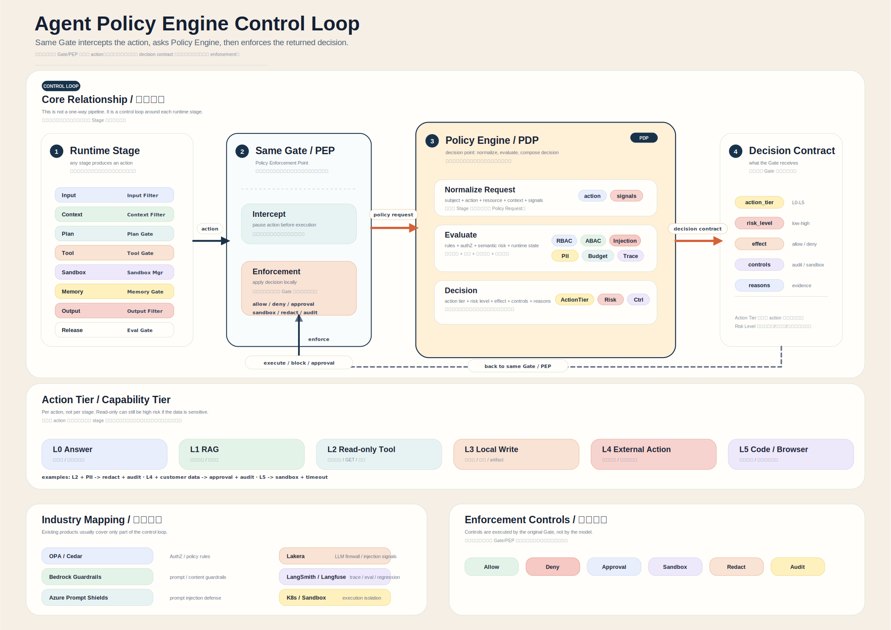
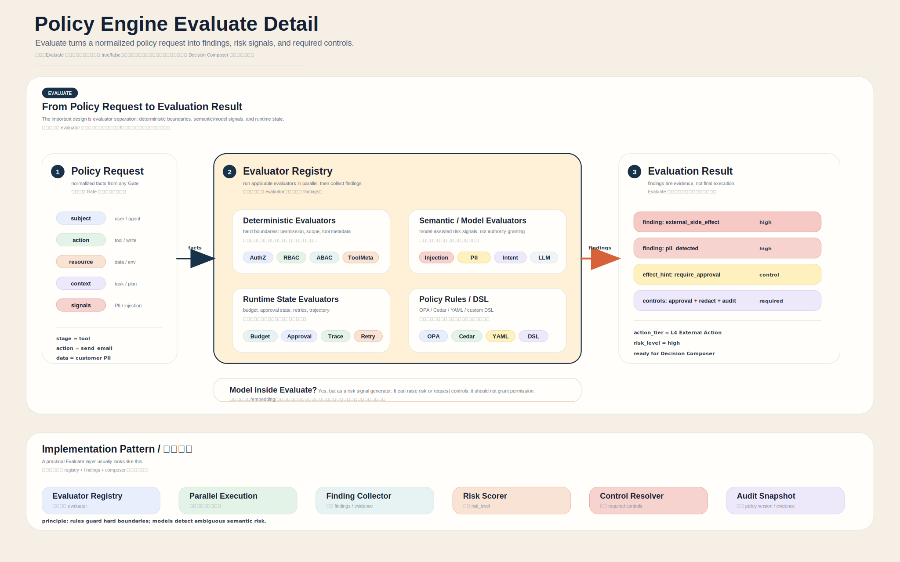

# Policy Engine

[English](../POLICY_ENGINE.md) | [中文](POLICY_ENGINE.md)

AgentLedger `1.1.0` 把 policy 设计成 runtime control loop，而不是简单的 boolean 权限判断。Runtime Gate 在动作执行前拦截 action，把统一的 `PolicyRequest` 交给 Policy Engine，拿到 `PolicyDecision` 后，再在原 Gate 落地执行控制。

## 控制闭环



核心是 PEP / PDP 分离：

| 部分 | 职责 | AgentLedger 中的位置 |
|---|---|---|
| Gate / PEP | 在执行点拦截并落地控制 | 当前是 `ToolGateway`；未来 model、memory、output、child-run gate 可以复用同一 contract |
| Policy Engine / PDP | 统一事实、运行 evaluator、组合决策 | `PolicyEngine.evaluate(...)` |
| Decision Contract | 告诉 Gate 应该怎么处理 | `PolicyDecision`，包含 effect、tier、risk、controls、reasons、findings |
| Audit evidence | 记录为什么这样决策 | `tool_permission_decided` payload 会带完整 decision contract |

## Evaluate 层



`PolicyEngine.evaluate(...)` 在 runtime-core 中保持 dependency-free。core 只提供确定性的内置 evaluator 和稳定 adapter seam；更重的策略系统通过 adapter 接入。

| Evaluator 层 | 当前 core 支持 | Adapter 边界 |
|---|---|---|
| 确定性边界 | role/tool/risk policy、explicit deny、high-risk default、tool metadata | 更完整 RBAC/ABAC 规则 |
| Runtime state | approval status、shadow-mode side-effect boundary、delegation context、media refs | 外部 workflow state 或 review 系统 |
| 语义/模型信号 | 只预留 contract 字段 | prompt injection、PII/DLP、intent classifier、安全服务 |
| Policy rules / DSL | YAML/JSON role-capability subset | OPA、Cedar、内部 policy service |

## 数据模型

| 对象 | 字段 | 作用 |
|---|---|---|
| `PolicyRequest` | `stage`、`subject`、`action`、`resource`、`context`、`signals`、`runtime_state`、`policy_version` | 把任意 runtime gate 的事件统一成策略请求。 |
| `PolicyFinding` | `id`、`severity`、`source`、`message`、`evidence` | evaluator 输出证据，不直接执行控制。 |
| `PolicyControl` | `kind`、`reason`、`metadata` | 告诉原 Gate 要落地什么控制。 |
| `PolicyDecision` | `effect`、`action_tier`、`risk_level`、`controls`、`reasons`、`findings`、`policy_version`、`subject_scope`、`delegation_allowed` | Gate 可执行的标准决策结果。 |

Effect：

```text
allow
deny
require_approval
```

Controls：

```text
audit
approval
sandbox
redact
budget
deny
```

Action Tier：

```text
L0 Answer / model-only
L1 Retrieval / RAG
L2 Read-only tool
L3 Local write / artifact
L4 External side effect
L5 Code / browser / sandboxed execution
```

`ActionTier` 描述能力边界，`RiskLevel` 描述结合上下文后的风险。只读动作如果访问敏感资源，也可能成为高风险。

## 当前执行路径

当前已落地的是 tool-level enforcement：

```text
ctx.call_tool(...)
  -> ToolGateway validate schema
  -> ToolGateway 构造 PolicyRequest
  -> PolicyEngine.evaluate(request)
  -> ToolGateway 记录带 PolicyDecision 的 tool_permission_decided
  -> ToolGateway 执行 deny / approval / sandbox / audit
  -> Tool Ledger 和 evidence 继续按原语义工作
```

老接口保持兼容：

```python
allowed, reason = policy.check_tool("ExecutorAgent", "github.create_issue", "medium")
```

这个 helper 内部已经基于新的 normalized policy contract。

## Sub-agent、Multi-agent 与 Media 边界

`1.1.0` 不实现 sub-agent / multi-agent execution，只为后续 child-run runtime 预留 policy 字段：

```text
subject.kind = agent | sub_agent | worker | service
context.parent_run_id
context.parent_step_id
context.delegated_by
context.delegation_allowed
```

media / stream 目前已经有 preview runtime contracts。PolicyRequest 可以治理 media refs，但 runtime-core 不变成 media engine：

```text
resource.kind = media_artifact | stream_checkpoint
resource.media_kind = image | audio | video | frame | transcript | embedding
```

core 负责 refs、metadata、lineage、evidence 和 replay 信息；image/audio/video 的真实处理仍由 adapter 完成。

## Core 不负责什么

runtime-core 不会变成：

- 完整 OPA 或 Cedar 替代品
- DLP 产品
- prompt-injection 产品
- policy 管理 UI
- 应用治理管理后台
- 完整 eval 平台

Core 负责 request/decision contract、确定性本地 evaluator、gate enforcement 和 audit evidence。重依赖或组织特定的智能判断应通过 adapter 接入。

---

generated by codex cli
